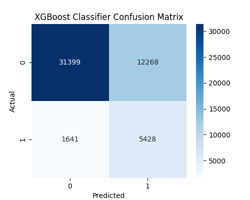

# Diabetes-prediction-ML-model-comparison
Two ML models - Logistic regression and XGBoost classifer were compared based on their accuracy to predict diabetes cases using BRFSS 2015 health indicators dataset.

DATASET
Source - https://www.kaggle.com/datasets/alexteboul/diabetes-health-indicators-dataset
Dataset file used for the models - diabetes _ binary _ health _ indicators _ BRFSS2015.csv. This dataset file has 21 feature variables and is not balanced.

EXPLORATORY DATA ANAYSIS 
1- Histograms to show numerical feature distribution 

2- Correlation heatmap to highlight highly correlated features 

PREPROCESSING
Dataset was split into 80% train and 20% test parts. Numerical features with more than 0.05 absolute correlation were selected. Numerical features were standardized and categorical features were one hot encoded. 

MODAL EVALUATION 
 

Both models achieve high accuracy probably due to class imbalance.

